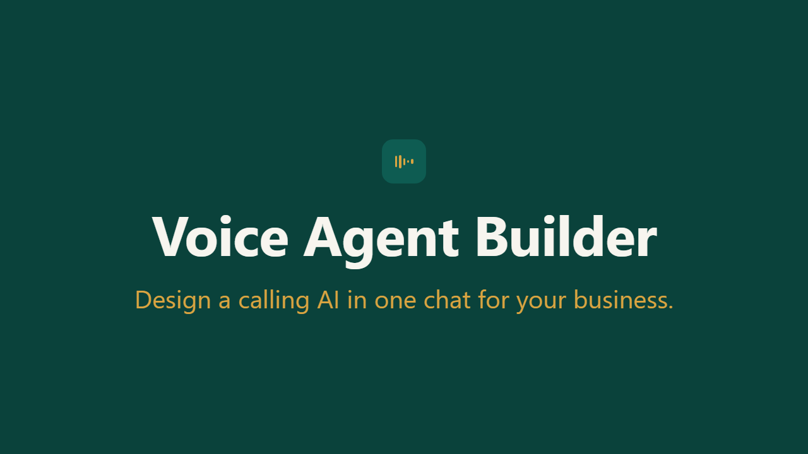
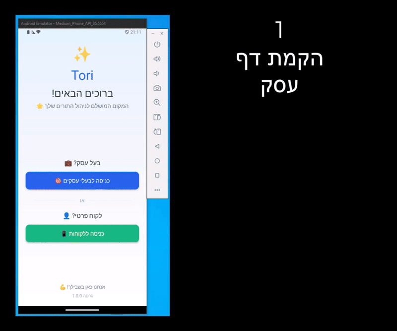
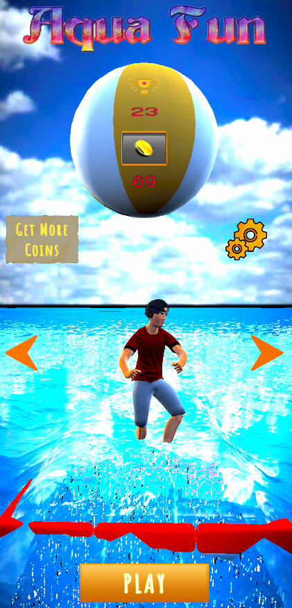
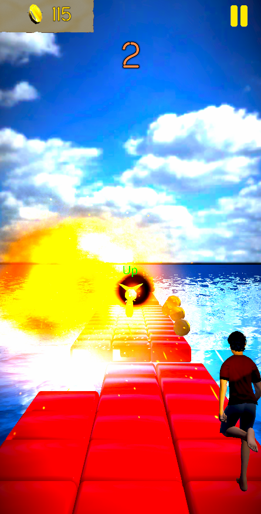
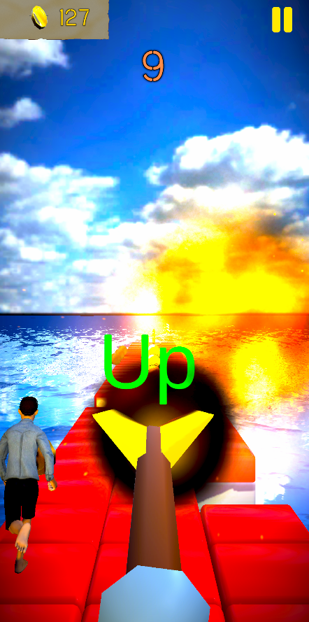

<h1 align="center">Hi 👋, I'm Roey </h1>

<h3 align="center">Software Engineer | AI Engineer | Full Stack | Game Developer
   
  Passionate about creative apps, AI-driven solutions, scalable systems, and impactful user experiences.   🚀🤖🎮</h3>

<h3 align="center">🧑‍💻 About Me:</h3>

<ul align="center">
  <li>📚 <strong>Lifelong learner</strong> with a strong background in Object-Oriented Programming, algorithms, and performance optimization.</li>
  <li>🌐 Experienced in full-stack applications, AI-augmented engineering, Unity game development, and scalable cloud-integrated systems.</li>
  <li>🚀 Published games and apps on Google Play, always aiming to merge creativity with solid engineering practices.</li>
</ul>

<h3 align="center">📫 Connect with me:</h3>

<h3 align="center"> **Email:** roeyshmil09@gmail.com  </h3>
<h3 align="center"> **LinkedIn:** [Roey Shmilovich](https://www.linkedin.com/in/roey-shmilo/) </h3>
<h3 align="center"> **Google Play Portfolio:** [ByteSpark](https://play.google.com/store/apps/developer?id=ByteSpark)</h3>
<h3 align="center"> **Chess Multiplayer:** [RoeyChess](https://roeychess-486015830819.us-west1.run.app)</h3> 
<h3 align="center"> **Website Portfolio:** [Unity Portfolio](https://roey-projects-999887439364.europe-west1.run.app/) </h3>

<h3 align="center">🛠️ Languages and Tools:</h3>

<h3 align="left">💻 Recent Projects:</h3>

- **Voice Agent Builder 🎙️🤖**:  
  An end-to-end AI voice automation platform built with **Next.js, Claude (Anthropic API), Vapi, and Cal.com API**. Allows users to build and configure autonomous voice agents via natural chat to conduct phone calls, qualify leads, and schedule calendar appointments automatically.  
  
🔊 **Click image to watch demo with audio:**     
  

- **Tori Business App 📊💼**:  
  Contributed to a **React-based business management app**. Practiced Agile teamwork, Git collaboration, modular architecture, and code reviews.  
  
    
  [Tori App Repository](https://github.com/RoeYeoR/Tori)

- **Published Unity Mobile Games 🎮📱**:  
  A collection of published mobile titles on Google Play:  
  
  - **Mitron 3D Shooter 🧟‍♂️🔫**: Zombie survival shooter featuring creative enemy AI, smooth mobile controls, and performance optimization.  
      
    [Mitron on Google Play](https://play.google.com/store/apps/details?id=com.mastik.mitron)  
    
  - **Aqua Fun 🌊🐠**: Fast-paced endless runner mobile game with colorful ocean-themed visuals.  
    

      
      
      
    

    [Aqua Fun on Google Play](https://play.google.com/store/apps/details?id=com.Mastik.AquaFun)
